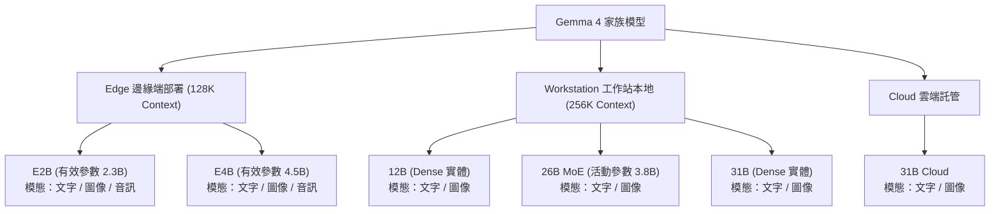

# Gemma 4 家族模型差異與使用場景分析

根據 `ollama.com/library/gemma4` 官方說明，Gemma 4 是由 Google DeepMind 開發的開放權重多模態模型系列，主要設計宗旨是**在不同尺寸下皆能提供前沿水準（frontier-level）的效能**。

Gemma 4 家族根據部署硬體與模態支援，主要區分為 **Edge 邊緣端模型**、**Workstation 本地工作站模型** 與 **Cloud 雲端模型** 三大類。

以下為各模型的差異性、技術規格與適用場景的詳細整理：

---

## 1. Gemma 4 家族模型架構分類

---

## 2. 各模型規格比較與使用場景

> [!IMPORTANT]
> **重大模態支援差異：**
> **僅有 Edge 模型（E2B, E4B）支援音訊輸入**。Workstation 與 Cloud 模型（12B, 26B, 31B）目前**不支援**音訊模態。

| 模型標籤 (Tag) | 架構類型 | 有效/活動參數 | 上下文視窗 | 支援模態 | 建議使用場景 |
| :--- | :--- | :--- | :--- | :--- | :--- |
| **`gemma4:e2b`** | Edge (Effective) | 2.3B (總共 5.1B) | 128K | **文字、圖像、音訊** | **超輕量本地端/行動裝置** ・適合手機、平板或物聯網設備。 ・適用於極致低延遲的語音助理、基本圖像物件辨識與日常對話。 |
| **`gemma4:e4b`** | Edge (Effective) | 4.5B (總共 8B) | 128K | **文字、圖像、音訊** | **平衡型邊緣端智慧** ・適合入門級筆電或邊緣計算盒。 ・提供優於 E2B 的理解與邏輯能力，適合本地端的多模態混和交互。 |
| **`gemma4:12b`** | Workstation (Dense) | 11.9B | 256K | **文字、圖像** | **開發人員個人工作站（主流推薦）** ・平衡性能與資源消耗，適合具備 16GB 以上 VRAM / 統一記憶體的 Mac 或 PC。 ・適用於代碼撰寫、邏輯推理以及本地 autonomous agent 開發。 |
| **`gemma4:26b`** | Workstation (MoE) | 3.8B (總共 25.2B) | 256K | **文字、圖像** | **高吞吐量本地推理** ・混合專家架構（MoE），總參高但每次僅活化 3.8B 參數。 ・提供接近 31B 的理解能力，但推理速度極快。適合本地伺服器或需要高速反應的自動化 Agent 流程。 |
| **`gemma4:31b`** | Workstation (Dense) | 30.7B | 256K | **文字、圖像** | **高精度本地極限推理** ・需要中高階工作站硬體（較大顯存）。 ・適合複雜科學問題推理、極限代碼庫分析、大文本精準閱讀與高難度邏輯推導。 |
| **`gemma4:31b-cloud`**| Cloud | 託管於雲端 | - | **文字、圖像** | **免本地硬體託管** ・當本地電腦效能不足以流暢執行 31B 檔案，但又需要其頂尖推理能力時首選。 |

---

## 3. Gemma 4 獨特核心功能與調校建議

根據官方最佳實踐指南，使用 Gemma 4 時應注意以下設定以獲得最佳表現：

### 1. 思考模式 (Thinking Mode)
*   Gemma 4 具備可配置的思考模式。如果想要模型在回答前進行結構性推理，可以在系統提示詞（System Prompt）開頭加入 `<|think|>` 標記。
*   在多輪對話中，記得**只將模型的最終回答（Final Response）存入歷史紀錄**，先前的思考鏈（Internal Reasoning）不需要傳給下一輪，以節省 Token 空間。

### 2. 視覺 Token 預算 (Visual Token Budget)
*   模型支援 70、140、280、560、1120 等不同的 Token 預算來代表單張圖片。
*   **低預算 (70 - 280)**：適合快速影格理解、圖像分類與描述，速度較快。
*   **高預算 (560 - 1120)**：適合 OCR、文檔解析、圖表讀取或細節小字識別。

### 3. 多模態輸入順序
*   請務必將**圖片或音訊內容放在文字 Prompt 之前**，以獲得最精準的跨模態對齊與回答品質。

### 4. 推薦採樣參數 (Sampling Parameters)
*   溫度（Temperature）：`1.0`
*   Top_P：`0.95`
*   Top_K：`64`
