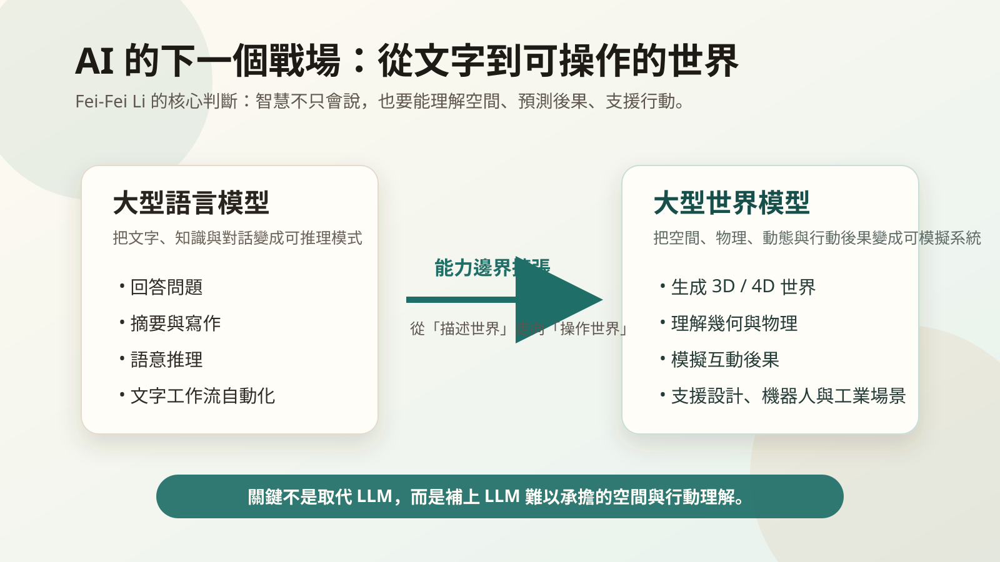
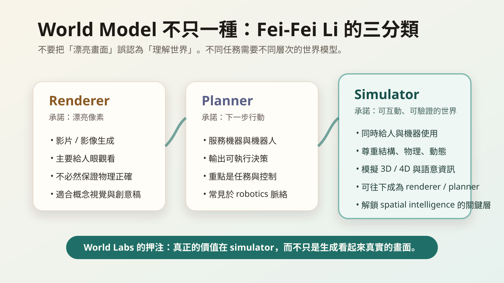

# World Labs 的 Fei-Fei Li 談 Large World Models｜訪談次主題深度導讀

**影片來源：** https://www.youtube.com/watch?v=pNYVckbCFuk  
**逐字稿來源：** 自動字幕逐字稿整理  
**訪談人物：** Fei-Fei Li, World Labs 共同創辦人  
**核心關鍵字：** Large World Models、Spatial Intelligence、World Labs、Simulator、Robotics、AI Safety、Education、AGI  

> 閱讀提示：逐字稿來自自動字幕，部分詞彙明顯辨識錯誤，例如 `relapse` 依語境應讀作 World Labs，`I` 多處應讀作 AI，`lambs/lent` 多處應讀作 LLMs。導讀段落採語意校正後的脈絡解讀；文末逐字稿則盡量保留原文，以便回溯。

## 摘要

這場訪談的核心不是「大型世界模型」這個新名詞，而是 Fei-Fei Li 對 AI 下一階段的判斷：智慧不能只停留在文字、聊天與知識回覆，還必須理解空間、物理、動態與行動後果。World Labs 追求的 spatial intelligence，目標是讓機器能生成、推理並操作 3D/4D 世界，進而支援創作、設計、機器人、工業模擬與醫療等場景。

訪談中最重要的區分，是她把 world model 分成 renderer、planner、simulator。Renderer 產生漂亮畫面，planner 幫機器決定下一步，simulator 則試圖保留世界的結構、物理、動態與語意，因此可能同時服務人與機器。這也說明為什麼世界模型若要真正有用，不能只追求「看起來真」，而要能成為可互動、可驗證、可承擔後果的模擬底座。

後半段訪談把技術問題拉回社會現場：AI 安全不該只是末日敘事或公關劇場，而要落在資料、評估、guardrails、使用者溝通與監管合作；AI 反彈也不是單純抗拒科技，而是公共對話被末日論與烏托邦敘事掏空後產生的焦慮。教育方面，她認為 AI 必然改變 K-16 學習與評量，但孩子仍然要學，只是要學會保有 agency，能引導 AI、判斷 AI，並用 AI 做出自己想做的影響。

---

## 次主題一：為什麼不是大型語言模型，而是大型世界模型？

時間範圍：約 00:00:00 - 00:01:52

這場訪談一開始就把問題放在今天 AI 產業最明顯的偏心上：所有人都在看 ChatGPT、Claude 與大型語言模型，但 World Labs 卻募資十億美元去做一件看起來不同的事。Fei-Fei Li 的回答不是從產品功能開始，而是從五億年的演化史開始。這個開場很重要，因為她不是在說「文字模型還不夠好」，而是在說「智能的起點本來就不是文字」。

她的核心判斷是：動物智能先從看見世界、在世界中移動、理解自己與環境的關係開始。語言當然重要，但語言是人類智能後來高度發展出的表達與溝通形式；在此之前，生物必須先知道哪裡有障礙、怎麼抓取物體、如何避開危險、如何與環境互動。若機器只會處理文字，它可以描述世界，卻不一定能理解世界的結構。

這裡的「大型世界模型」不是比較炫的影片生成器，而是 World Labs 對 spatial intelligence 的技術路徑。Spatial intelligence 指的是機器能感知、理解、推理並操作 3D/4D 世界的能力。3D 是空間結構，4D 則包含時間中的變化、動態與互動。Fei-Fei Li 把它連到創造力、生產力、虛擬世界、機器人與人類輔助，意思是：未來的 AI 不只要會回答問題，還要能在某個世界中「知道自己正在改變什麼」。

這也揭示了 LLM 的結構邊界。大型語言模型擅長把文字中的關係壓縮成可推理的模式，但火災現場、醫療照護、工廠機台、居家設計與遊戲世界，都不是純文字空間。它們需要尺度、幾何、材質、碰撞、時間、因果與可行動性。文字可以說「把鍋子放到爐上」，但真正的智能要知道鍋子的形狀、手的位置、重力、熱源、安全距離，以及下一步動作會造成什麼後果。

所以這個次主題真正要讀出的不是「世界模型會取代語言模型」，而是 AI 的能力版圖正在從語言符號走向可操作世界。語言模型讓機器進入人類知識系統；世界模型則試圖讓機器進入物理與虛擬環境。兩者不是簡單競爭，而是不同層次的智能基礎設施。

---

## 次主題二：世界模型能做什麼，是 LLM 很難真正完成的？

時間範圍：約 00:01:52 - 00:03:14

主持人問了一個很直接的問題：大型世界模型最終能做到什麼，是大型語言模型永遠做不到的？Fei-Fei Li 的回答用了幾個帶有現場感的例子：滅火、煎蛋、設計室內空間、設計機器、設計房子、設計故事、支援遊戲、數位分身、工業檢測、最佳化任務、醫療與製造。

這些例子看似分散，其實都指向同一件事：世界模型的價值在於把「生成」和「可行」接起來。文字模型可以生成一份室內設計描述，但世界模型要能讓使用者看見空間、調整物件、理解比例、模擬光線、知道家具是否擋住門、甚至推估人在其中行走是否順暢。文字模型可以寫出機器人拿盤子的步驟，但世界模型要知道盤子的位置、機器手臂的關節限制、桌面高度、接觸力與失敗後的修正。

這裡也能看出她談 creativity 的方式很特別。她不是把創造力侷限在藝術或影像，而是把創造力視為人類對世界做設計、重組與試驗的能力。室內設計、機器設計、故事設計都需要想像一個尚未存在的世界，並判斷它是否能成立。世界模型若成熟，會把創作者從「用文字描述想像」推進到「直接操作想像中的環境」。

在產業應用上，這會改變數位孿生與機器人訓練的成本結構。今日許多工業最佳化仍仰賴昂貴模擬、專門軟體與大量工程設定；若世界模型能生成可推理、可互動、可驗證的場景，工程師就能更快測試不同配置，機器人也能在虛擬世界中練習罕見或危險任務。這不是把現實世界搬進電腦而已，而是讓模型成為「可試錯的現實替身」。

但這裡也要保留一個限制：世界模型若只是生成漂亮畫面，它仍不等於理解世界。滅火、醫療、製造這些場景需要高可靠性、物理一致性與責任邊界。模型必須能承受工程驗證，而不是只讓人覺得畫面逼真。這正好連到後面她對 world model taxonomy 的分類。

---

## 次主題三：大型世界模型會不會有自己的 ChatGPT 時刻？

時間範圍：約 00:03:14 - 00:04:31

主持人追問世界模型的「ChatGPT moment」會長什麼樣子。這個問題背後有一個產業假設：真正重要的 AI 技術，應該會像 ChatGPT 一樣突然被大眾看見、快速爆紅、成為日常消費行為。Fei-Fei Li 的回答反而更謹慎：她還在思考世界模型是否會有相對應的 consumer moment，因為這類應用可能先進入專業創作者、設計師、開發者、研究者、工程師，以及機器人與工業設計場景。

這一段的深意是：不是每一種基礎技術都會以聊天產品的形式爆發。ChatGPT 的爆發來自一個極低門檻的互動介面：任何人都會打字，也都能立刻感覺到回覆是否有用。但世界模型處理的是空間、設計、模擬與操作，使用情境可能更專業，工作流也更複雜。它的價值未必先表現在「人人打開網頁聊天」，而可能先表現在設計師改稿更快、機器人工程師訓練更便宜、遊戲開發者建構世界更容易。

Fei-Fei Li 仍留下了一個消費者想像：她說自己也想更容易設計家裡，例如一鍵改變窗簾顏色。這個例子很小，卻是很好的產品線索。世界模型若要有大眾時刻，可能不是以「問答」形式出現，而是以「直接修改世界」的形式出現。使用者不需要懂 3D 軟體，不需要懂渲染，不需要懂建模，只要指出想改什麼，系統就能在保持空間一致性的前提下產生變化。

這裡的關鍵落差在於：聊天是語言介面，世界模型需要操作介面。大眾產品要成功，不只取決於模型能力，也取決於互動設計。使用者如何指定空間？如何選取物件？如何比較版本？如何知道生成結果是否符合物理與安全？這些問題沒有解開之前，世界模型可能先在專業場景中累積價值，再逐步滲透到消費端。

因此，世界模型的 ChatGPT 時刻未必是一個突然爆紅的單一產品，而可能是一系列專業工作流被重寫的時刻。當建築、遊戲、機器人、工廠模擬與居家設計都開始把「生成可互動世界」當成基本能力，我們才會回頭發現，世界模型其實已經抵達。

---

## 次主題四：World Labs 的差異化，不是只有模型，而是對 world model 的分類

時間範圍：約 00:04:31 - 00:07:47

競爭問題是這場訪談中最有資訊密度的一段。主持人提到 Jonathan Last、Google Project Genie、Nvidia Cosmos，以及 Nvidia 同時也是 World Labs 投資人，追問 World Labs 有什麼別人沒有的東西。Fei-Fei Li 先談團隊、信念與起步時間，但真正值得注意的是她接著提出的 world model 功能分類。

她說「world model」這個詞已經被用得太混亂，因此 World Labs 發表文章嘗試釐清。依她的說法，當我們談 spatial intelligence 的世界模型時，至少要分成三類：renderer、planner、simulator。

Renderer 是把漂亮像素放到螢幕上。它最接近一般人熟悉的影片生成模型，主要消費者是人眼。這類模型可以很驚艷，但它承諾的是視覺效果，不一定承諾物理、動態與幾何正確。換句話說，它可以讓你覺得「看起來像」，但不保證這個世界能被機器拿來計算、操作或規劃。

Planner 則偏向機器或機器人使用。它根據世界狀態或動作輸入，輸出下一步應該採取的正確行動。這類世界模型常出現在 robotics 脈絡，重點不是讓人看見漂亮畫面，而是幫助系統做出可執行決策。

Simulator 是她認為三者中的 linchpin，也就是最關鍵的一層。它同時可供人類與機器使用，試圖尊重世界的結構、物理、動態、3D/4D 資訊與語意資訊。更重要的是，simulator 可以向下成為 renderer，也可以向下成為 planner。若一個模型真正掌握可模擬的世界，它可以渲染畫面給人看，也可以提供狀態與後果給機器規劃。

這個分類的價值，在於它避免把「看起來像世界」誤認為「理解世界」。今天許多生成式影片讓人震撼，但若物體在幾秒後形變、空間關係不穩、因果不一致，它就很難成為機器人或工業系統的核心基礎。Fei-Fei Li 的策略判斷是：World Labs 要攻的是 simulator 這層，因為這層才可能真正解鎖 spatial intelligence。

對企業讀者來說，這個分類也能轉成採購與評估語言。若你的需求是廣告視覺或概念影片，renderer 可能足夠；若你的需求是機器人路徑與動作，planner 是重點；若你的需求是訓練、驗證、互動設計、數位孿生與跨場景推理，simulator 才是核心。不同任務不能只用「生成效果好不好」來評估。

---

## 次主題五：機器人熱潮與現實落差：世界模型能補上哪一塊？

時間範圍：約 00:07:47 - 00:09:18

主持人把話題轉向 humanoids，並指出機器人募資很熱，但現實能力仍有限：它們還不能像人一樣快速把碗盤放進洗碗機，也不能替人拿 Amazon 包裹。這是典型的 hype versus reality 問題。Fei-Fei Li 的回答有兩層：第一，她認為 robotics 將是人類工業化史上最重要的革命之一；第二，六十億美元其實不算多，若與自駕車或大型語言模型投入相比，機器人需要更多時間、資本與審慎努力。

這段話最值得注意的是她沒有否認落差，而是把落差放回技術成熟曲線。機器人之所以困難，不是因為硬體不夠酷，而是因為真實世界極度混亂。每個廚房不同，每個物件都有不同形狀、重量、材質與擺放方式；拿包裹看似簡單，卻涉及辨識、導航、抓取、避障、門禁、天候、行人與安全責任。人類覺得簡單，是因為人類有長期累積的身體智能。

世界模型在這裡扮演的是中間層。它不直接等於機器人本體，也不只是機器人的大腦口號，而是讓機器人可以在行動前理解環境、預測後果、在虛擬情境中練習、把失敗經驗轉化為可更新的模型。若沒有足夠好的世界模型，機器人只能靠硬寫規則、有限資料或昂貴實地測試慢慢累積。

她說 World Labs 正在處理 physical intelligence 其中一項關鍵技術，這個說法相對克制。它不是宣稱世界模型會立刻解決所有 humanoid 問題，而是說 simulation layer 與 spatial intelligence 是縮短落差的必要條件之一。必要條件不等於充分條件：機器人仍需要硬體成本下降、感測器可靠、控制系統穩定、安全規範成熟，以及商業場景能承擔部署風險。

因此，這段最好的讀法不是「humanoid 很快要進家門」，而是「若機器人真的要從展示走向產業化，世界模型必須成為它的訓練場與推理底座」。資本熱潮能買來嘗試次數，但真正的進展要看能否把真實世界的複雜性壓縮成可學習、可模擬、可驗證的系統。

---

## 次主題六：AI 安全不是劇場，也不是末日敘事，而是落地工程

時間範圍：約 00:09:18 - 00:12:14

訪談進入 AI safety 時，Fei-Fei Li 的立場延續她一貫的「measured」風格。她對末日敘事保持距離，也不支持粗重、僵硬的監管語言；但她沒有否認安全工作的重要性。她把目標說得很樸素：任何技術與產品都應該賦能、增強、輔助人類，而不是傷害人類。這不只適用 AI，也適用所有工程工作。

她提出的安全工作清單非常實務：使用什麼資料、建什麼系統、做什麼評估、設什麼 guardrails、如何與使用者和客戶溝通、如何與監管者合作。這些詞聽起來不像宏大哲學，但正是安全從口號變成工程的地方。真正的安全不是在台上喊「我們重視責任」，而是能在資料流程、模型評估、產品邊界、使用者告知與事故處理中被看見。

她接著用醫療照護舉例，讓這段更具體。醫師已經用 AI 協助 charting，放射科醫師用 AI 協助讀 MRI 和 CT，病患家屬也會把放射報告交給 AI 協助理解。這些例子不是科幻，而是現場正在發生的使用方式。AI 安全因此不能只停在抽象風險，也要面對真實場景中的需求：病人需要理解報告，醫護需要減少文書負擔，放射判讀需要輔助，但每一步都涉及準確性、責任、隱私與人類覆核。

這裡可以讀出她對「safety theater」的反對：如果安全討論只是為了製造姿態，會錯過真正需要改進的地方；如果安全討論只剩末日或烏托邦，也會讓醫療、教育、工作現場的具體風險被忽略。她主張的是 scientifically grounded 的安全對話，也就是基於實證、評估、場景與責任分工來推進。

這對企業導入 AI 很有啟發。真正的安全治理不應只是寫一份 AI 使用政策，而要落在幾個可操作問題上：哪些資料可以進模型？哪些任務只能輔助不能自動決策？模型錯誤如何被發現？使用者是否知道 AI 的限制？高風險場景是否有人工覆核？這些問題回答得越具體，安全就越不是劇場。

---

## 次主題七：「AI hate wave」背後，是公共對話的真空

時間範圍：約 00:12:14 - 00:15:08

主持人提到 AI 反彈浪潮，包含前 Google CEO Eric Schmidt 在畢業典禮被噓的例子，問 Fei-Fei Li 學生到底在想什麼、害怕是否合理。她先承認自己接觸的 Stanford 學生相對 privileged，因此更重要的是走向 K-12 教師、護理師、父母、祖父母，以及那些覺得自己沒有被納入對話的人。

這是一段非常關鍵的社會診斷。她沒有把 AI 焦慮簡化成無知，也沒有把學生或大眾的恐懼當成技術進步的阻力。她說社會情緒是混合的：有希望、興奮、困惑，也同時有尊嚴與能動性的提升，以及尊嚴與能動性的喪失。AI 可以幫人做到以前做不到的事，這會帶來 agency；但若 AI 威脅工作、專業身份或人生規劃，也會讓人覺得 agency 被奪走。

她把問題根源指向 thoughtful public discourse 的真空。今天的公共空氣被兩種極端吸走：一邊是末日論，另一邊是完全烏托邦。當 hype 佔滿房間，真正生活在中間的人就找不到可以信任的答案。這個「真空」才是焦慮滋生的地方。

這段話的洞見在於：AI 接受度不是單靠技術展示能解決的問題。人們需要知道自己在新技術中的位置、權利、風險與學習路徑。教師想知道怎麼教，護理師想知道會不會被替代，家長想知道孩子還需不需要學，員工想知道自己的技能是否過時。若產業只回應「模型越來越強」，就等於沒有回答真正的問題。

Fei-Fei Li 給自己的角色定位是科學家、教育者、創業者，因此責任是不要 hype，而是以科學與謙遜說話。這句話在今天很有重量，因為 AI 產業太常把不確定性包裝成必然。她的語氣提醒我們：公共信任不是由最震撼的 demo 建立，而是由可理解、可質疑、可參與的對話建立。

---

## 次主題八：AI 會改變教育，但孩子仍然必須學習

時間範圍：約 00:15:08 - 00:16:48

教育段落的起點很私人：主持人說兩人都是母親，也都有年輕青少年，問 AI 會如何改變學習與大學經驗。Fei-Fei Li 的回答非常直接：AI must change learning，而且是 K 到 16 的整個學習系統。

她把教育問題提高到人類資本層次。世界最珍貴的資源是 human capital；當 AI 已經能回答從標準化測驗到數學奧林匹亞等題目時，問題不是「人類比較差」，而是教育系統必須改變。這句話很重要，因為它避開了人機競賽式的焦慮。若 AI 能考高分，代表標準化評量的意義被改寫，不代表孩子不需要理解、判斷、創造、合作與負責。

她提出三個改變方向：改變教育系統、改變評量方式、改變教師被賦能的方式。這三者缺一不可。若只禁止學生使用 AI，教育會與現實脫節；若只放任學生使用 AI，學習可能變成外包；若只要求教師吸收新工具卻不給時間、訓練與制度支持，改革會變成壓力轉嫁。

主持人追問孩子是否還會學習，Fei-Fei Li 說 absolutely，前提是我們教得對、社會準備得對。孩子不應害怕 AI，而應感覺到人類能動性：引導 AI、正確使用 AI，並用 AI 做自己想對世界造成的影響。這裡的重點不是讓孩子更早學會 prompt，而是讓孩子建立能判斷 AI、駕馭 AI、超越標準答案的能力。

對台灣教育現場而言，這段可以轉成幾個具體問題：考試是否仍只測可被 AI 快速回答的題型？作業是否要求學生揭露 AI 使用方式？教師是否有工具來設計更重視過程、口頭辯證、實作與反思的評量？學校是否教學生辨識 AI 錯誤、偏誤與幻覺？若這些問題不處理，AI 只會讓既有教育矛盾加速暴露。

---

## 次主題九：她為什麼不談 AGI？因為名稱不是目標本身

時間範圍：約 00:16:48 - 00:18:18

最後一段談 AGI。主持人引用 Anthropic CEO Dario Amodei 對 AGI 時程的看法，也提到 Demis Hassabis 說人類站在 singularity 的山腳，接著問 Fei-Fei Li：她不使用 AGI 這個詞，是因為不同意他們，還是只是對目標命名不同？

她的回答非常有代表性：她不 engage with the term AGI，因為人工智慧這門科學的創始者原本就有一個夢想，也就是建造能思考、能行動的機器。這是科學追求，也是她一生的工作。現在她把這個科學追求與能改善人們生活的產品結合，而這整個領域就叫 artificial intelligence。別人要叫它 AGI、蘋果或其他名字都可以，她關心的是打造真正能改變人們工作與生活的技術。

這不是逃避問題，而是拒絕被名詞綁架。AGI 在今天的產業語境中常被賦予過多情緒：投資敘事、末日焦慮、公司競爭、政策恐慌、媒體標題。Fei-Fei Li 把焦點拉回工程與產品：技術能不能真的幫到人？能不能在具體場景中帶來新的能力？能不能改善醫療、教育、科學、工作與創造？

她最後說，希望今年能出貨一個 spatial intelligence 模型，啟發人們還沒看過的產品機會。這個結尾其實和開場呼應：她不想把 AI 的下一步定義為某個抽象終點，而是把它定義為新的可用能力。當模型能理解、生成、推理並操作世界，新的產品型態才會出現。

這段對 AI 策略討論有很強的提醒：不要把 AGI 當作唯一坐標。對企業、教育、醫療與公共政策來說，更有用的問題往往是：目前模型已經能可靠做什麼？還不能可靠做什麼？需要哪些資料、評估、覆核與責任制度？下一個可被驗證的能力邊界在哪裡？這些問題比爭論 AGI 幾年後到來更能推動真正進展。

---

## 綜合導讀：從語言智能到世界智能，AI 的下一個戰場是「可操作的現實」

這場訪談的表層主題是 World Labs 與大型世界模型，但更深的主題是 AI 智能觀的轉移。過去幾年的生成式 AI 讓人以為智能主要表現在語言、知識與對話上；Fei-Fei Li 則提醒我們，智能更古老、更根本的形式，是身體與世界的關係。看見、移動、預測、抓取、設計、避險、修正，這些能力不是文字的附屬品，而是生命在世界中存活與創造的基礎。

大型世界模型的重要性，就在於它可能補上語言模型缺少的世界結構。若 renderer 只提供漂亮畫面，它仍停在感官層；若 planner 只輸出下一步動作，它可能侷限於特定任務；但 simulator 若能穩定模擬物理、幾何、動態與語意，就可能成為人類創作、機器人訓練、工業設計與虛擬世界的共同底座。

這也是為什麼她談 AI 安全、公共焦慮與教育時，都採取同一種態度：不要被口號帶走，要回到具體世界。安全要看資料、評估、guardrails 與醫療現場；公共焦慮要看教師、護理師、家長與學生是否被納入對話；教育改革要看評量、教師賦能與孩子的 agency；AGI 爭論要回到技術是否真的改善生活。

換句話說，這場訪談真正的訊息不是「下一波是世界模型」這麼簡單，而是 AI 產業必須從語言炫技走向世界責任。當 AI 開始進入機器人、醫療、教育、工業與家庭空間，它面對的不再只是回答得漂不漂亮，而是能不能理解環境、承擔後果、讓人保持尊嚴與能動性。這才是 spatial intelligence 的技術挑戰，也是它的社會挑戰。

---

## 可讀版逐字稿

以下將原始 `.srt` 逐字稿改排為閱讀版：移除字幕序號與破碎換行，依前文次主題分段，並保留時間碼方便回到影片核對。自動辨識造成的英文錯字大致保留，不改寫成摘要或翻譯。

### 次主題一：為什麼不是大型語言模型，而是大型世界模型？

時間範圍：00:00:00 - 00:01:52

Everyone is focused on Llms ChatGPT, Claude large language models. But you have raised $1 billion to build something different. Large world models make the case for us. What is the bet you are making that others aren't? Right? So, um, this is my, uh, co-founded startup relapse, and, uh, we are, uh, all in, in spatial intelligence. And, uh, the means to spatial intelligence is building a large world model. So what is the case for us? The case for us is a 500 million year story, is that animal intelligence starts with seeing and moving in the physical world. That, uh, evolution began with us as animals, knowing what the world is, knowing, knowing who we are, knowing how to move around it, interact with it.

And, uh, much of life, human life, human work life, human private life has a lot to do with perceiving, understanding, reasoning, interaction with the world, including imaginary world of creativity, of uh, of, uh, productivity, uh, as virtual worlds. So unlocking that capability in machines, unlocking the capability of generating alien 3D, 4D worlds, unlocking the capability of reasoning within any world. Unlocking the capability of, um, teaching agents or robots, or assisting humans to interact with the world is what spatial intelligence is about. And that's what we are focusing though.

### 次主題二：世界模型能做什麼，是 LLM 很難真正完成的？

時間範圍：00:01:52 - 00:03:14

So what can world models do ultimately that Llms will never be able to. Kill words. Put down fires to words, uh, cook an omelet? Mm. I think, uh, there's so much rye. So we, um, for example, creativity, um, people design people. Uh. Uh, whether we're designing interior space, we're designing, uh, machines were design. We're designing homes, we're designing stories. So much of that is beyond words. Uh, we also use agents. Uh, whether we use agents, a virtual world, whether it's for entertainment like gaming or for, uh, more serious industrial, um, industrial applications, whether it's digital twin, um, design or inspection or optimal or what kind of, uh, many kind of optimization tasks.

Or we, uh, build robots and, uh, to help us to do a lot of things from, um, putting down fire to, uh, helping healthcare scenarios to manufacturing all those our application downstream applications of, uh, unlocking spatial intelligence and building moral models. So what's the what do you think the

### 次主題三：大型世界模型會不會有自己的 ChatGPT 時刻？

時間範圍：00:03:14 - 00:04:31

ChatGPT moment for world models will be like? How will we know this has arrived? Yeah, that's a great question, Emily, because chat is such a consumer behavior that chat GPT moment tends to be used to describe a viral, uh, public consumer moment of getting so close to what I can do in the, in the world of world models. Um, the kind of spatial intelligence we're trying to unlock. Um. I'm still trying to figure out if there is a corresponding consumer moment, because the kind of applications we are talking about, um, tend to be first, go into the professionals, professional creators, professional Designers. Professional developers. Professional researchers and engineers who use it for robotics and industrial design and all that. So maybe we will not necessarily have a consumer moment, but maybe we will.

And you know, I would love to design my home in a much easier way and just change the color of the curtains, you know, with a click.

### 次主題四：World Labs 的差異化，不是只有模型，而是對 world model 的分類

時間範圍：00:04:31 - 00:07:47

All right. That sounds pretty cool. So in the last six months, Jonathan last mapped out to work on world models. Google shipped Project Genie. Nvidia has its own world models. Cosmos Nvidia is also one of your investors. What do you have that they don't? And which competitors out there? Where are you the most? Yeah. So first of all, we started we're laps into 2024. I still remember when when we were out talking about our models and spatial analogies. It was just a year after ten people were still totally talking about lent. And so we we really had a head start and understanding that this is going to be the next frontier of. I am very excited by that. So, uh, what do they have? We don't know. First of all, I think we have an incredible team. We have the conviction. They don't have the godmother, that's for sure.

Um, but but the world is big, and I think this is just like lambs. I think there will be many companies doing incredible working world models. Just as 24 hours ago. Uh, I, we kind of got fed up that the word world model has been so, uh, confusing and being used so in so many different ways that we actually put out a, uh, a blog just explaining what a functional taxonomy of world model is instead of mushing everything together. And the way I see it is right now, there are three ways, uh, of calling world models when it comes to spatial intelligence. One is what I call a renderer. When the model puts beautiful pixels on the screen, mostly like video generation model and the consumer is mostly human eyeballs.

And while the model commits to beautiful pixels on the screen, it doesn't necessarily commit to, um, uh, physics and dynamics and geometric correctness. Uh, because that's just, um, consuming human life, all consuming, not necessarily for computation and other other tasks. Then another kind of, uh, world model is what we call, um, a planner that is more for machines, more for robots, where it outputs, um, whatever the input is, the state of the world or the action, it outputs a correct action to take to the next step. And you see that kind of world model a lot for robotics applications. And you hear that in that context.

The third kind, which I think is the linchpin of the three is a simulator, is that it actually is consumed by humans as well as machines, is trying to respect the structure, the physics and the dynamics of the world and really simulate the 3D and, uh, 4D um, information of the world as well as well as the semantic information. And the simulator could become a renderer, the simulator could become a planner, but this layer is, um, a huge critical path, in my opinion, to unlock spatial intelligence. And that's what, uh, we're a lab is, uh, working out. All of this rolls up into robotics.

### 次主題五：機器人熱潮與現實落差：世界模型能補上哪一塊？

時間範圍：00:07:47 - 00:09:18

So I want to get your take on the field. And humanoids in particular. Funding for humanoids hit $6 billion. But, you know, they still can't load my dishwasher as fast as I can. They still can't go get my Amazon packages. Well, world models, world labs closed the gap between hype and reality. That's a loaded question, Emily. First of all, that is my job. Yes, I get it. First of all, robotics is going to be one of the most important revolutions in human industrialization. $6 billion is too small, right? If you look at self-driving cars investment. If you look at language models, investment, it took way more than $6 billion. I'm not saying we now. I think it will take time to invest, and it will also hopefully not take the hype, but take the thoughtfulness to invest in the right effort.

And for example, unlocking worlds modeling and spatial intelligence and simulation layer. All this is part of that, that, uh, important, uh, effort. Um, well, are we going to close the gap? I do believe World Labs is working on one of the most critical technology in the speech of physical intelligence. And obviously that's the that's the hope.

### 次主題六：AI 安全不是劇場，也不是末日敘事，而是落地工程

時間範圍：00:09:18 - 00:12:17

Mhm. You've been more measured on eye safety skeptical of the doom narrative but also of heavy handed regulation. When you look across the industry. Where do you feel real safety work versus safety theater. Is anyone getting it right. So in general I've been just more measured on every every rhetoric makes me very boring, to be honest. Um, I think there's just so much hype. There's so much hype. Um, obviously we need to build the right technology. We need to guard rail. The technology. Whether you use the word responsible, you use the word safety, you use the word um, uh, trustworthy, uh, building the right technology and product so that it can empower, enhance, augment humanity and not harm them. Is the goal of any any work we do, whether it's I or not? So where is it doing? Right?

I really hope every company, every, um, every product that's being built, that the people behind it are very mindful of that and are thinking about, you know, what data are we using? What system are we building, what evaluations are we conducting, what guardrails are we putting in? How do we communicate with, uh, with our users and customers? How do we work with regulators so that when the rubber hits the road that we are, um, you know, being responsible? I do believe a lot of this work is happening. It's not happening in the theater, to be honest, for example.

So building pharmaceutical and health care, uh, industry, uh, companies are incorporating I, uh, literally I just came from the hospital to come to your to to your panel because I have a family member, uh, about to get a surgery in the next one hour or so, and I, I was just in her hospital looking at where I is already being used and where I could be used, and it's already happening. Doctors are using I to to to help them with charting. Radiologists are using AI to assist them reading the the MRI and the CT scans. I do hope that we have more AI to help our nurses to help family members. I got this long radiology report last night, and the first thing I did is send it to her eye so that they can help me to explain it. So all this is happening, um, safety measures are happening.

Um, but there needs to be more in the right way in a in a scientifically grounded way. Um, and that's the conversation that should be taking place instead of what you say, the theater. Well, thank you for coming, and I hope your person is okay. We all we all do.

### 次主題七：「AI hate wave」背後，是公共對話的真空

時間範圍：00:12:17 - 00:15:08

Um, the backlash is real. It's being called the I hate wave. I'm sure you've seen the video. Former Google CEO Eric Schmidt getting booed at a college graduation. You spent a lot of time with students. What are they saying? And if they're scared, are the fears justified? Yeah. I do spend a lot of time with students. Uh, to be fair, my students are pretty privileged because they're Stanford students. I think it's I think it's even more important. And I tried to do it myself, that we spend time with our teachers, with our nurses, with our parents, grandparents. And that's actually something that I try to do. I try to talk to K-12 educators. I try to go to places and talk to people where they feel that they're not part of the conversation and even stuff. Our students reflect some of this mixed sentiment. There is society.

There is a sense of hope. There is also excitement. There is also confusion. There is also, um. Simultaneously, a sense of dignity and agency. When I can help me do things that I couldn't do before. And a sense of loss of dignity and agency. If I is, is it going to take my job? So I think, uh, I think the sentiment is mixed. And I really want to point out a lot of this sentiment happens when there is a vacuum of thoughtful public discourse. Right now, the oxygen, the air is all sucked into the polarized extreme of ism or total utopian. And, well, hype takes all the oxygen in the room. That void brews the kind of anxiety. And it's actually that void we really need to care about, because that's where real people live. That's where real people are seeking answers, and I think it's, uh.

Um, as a scientist and an educator and an entrepreneur, uh, I'm on ground zero with students, with educators, with entrepreneurs. And I really do believe it's is one of my responsibility to not hype and try to speak with, with both science and humility and, and inspire people to to recognize this is a technology that can truly empower a lot of our work and life, can truly help us, you know, have a better health care system, have better scientific discovery, have better, uh, um, better environment, better education if we do the right thing.

### 次主題八：AI 會改變教育，但孩子仍然必須學習

時間範圍：00:15:08 - 00:16:44

Mhm. We're both moms. We both have young teenagers. How do you think I will change learning in the college experience I must change learning. I must change K to 16 learning. I think this is one of the biggest opportunity for humanity in the next decade to come. Is that what is? The most precious resource of our entire world? Is human capital. And when we have gotten a technology that can answer standardized tests, whether it's, it's, uh, uh, Common Core kind of test all the way to International Olympiad of math exams. Well, I can do better than average human. It's not about humans are bad. It's about we need to change the education system. We need to change how we evaluate.

We need to change the way we empower teachers to teach, to to educate the next generation of students where they can use these tools, beam power and do things that we can never imagine. So do you think our kids will still learn? Absolutely. If we teach them right. If the society prepares them right, they should not be. All of the kids today should not be scared of. They should feel the human agency to to lead I to use I in the right way and to use I to make the right, uh, to make the impact that they want to make for the world.

### 次主題九：她為什麼不談 AGI？因為名稱不是目標本身

時間範圍：00:16:44 - 00:18:22

Anthropic CEO Dario Ahmadi has suggested AGI is 2 to 3 years out. We'll get there by scaling the current paradigm. Demis Hassabis says we're at the foothills of the singularity. You've said you don't even engage with the term AGI. Are they wrong, or is the disagreement about what we're calling the goal? I don't engage with the term AGI because the founding fathers of artificial intelligence as a scientific field had this dream of thinking and, uh, doing machines. Uh, that is a scientific quest. And that quest has been my lifelong career, and I am still on that quest. Now, I'm combining that scientific quest with making products that can make people's life better. And that is the field called artificial intelligence. And, uh, um, I'm okay. People call it whatever they want. They can call it an apple. That's fine.

Um, I'm focusing on, um, building a technology that can truly that can truly make a difference in people's lives, a work. What's the one thing you'll have shipped this year that we'll be talking about next year? I hope that we will be shipping a model over spatial intelligence that will inspire incredibly exciting product opportunities that people haven't seen before.
